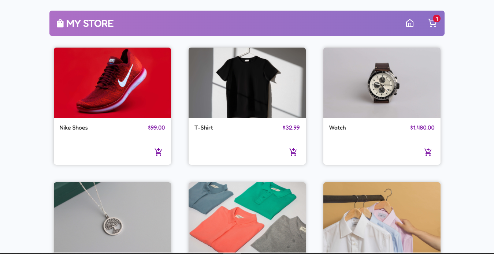

  
  <h1>E-Commerce Website <a href="https://mbecommerce.netlify.app/" target="_blank"
    >(watch online)</a
  ></h1>
  

    An E-Commerce app with ReactJs using CommerceJs for the backend stuff. In the app you can add a product to your cart. In the cart you can change the quantity of a product, delete a product or delete all the products in your cart.
  

   

    Edit the codes and let me know if you have more knowledge or better ideas.
  

  
In the project directory, you can run:

  <pre>npm start</pre>
  

    It runs the app in the development mode. Open
    <a href="http://localhost:3000">http://localhost:3000</a> to view it in the
    browser.
  

  

    The page will reload if you make edits. You will also see any lint errors in
    the console.
  

